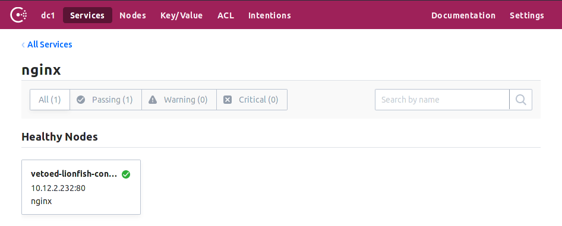

# Deploying Consul on Kubernetes

This guide demonstrates deployment of [HashiCorp Consul](http://consul.io) running on Kubernetes
and deployed via the official HashiCorp [Helm](https://helm.sh/) Chart. The [Chart](https://github.com/hashicorp/consul-helm) can be used to deploy
both a set of Consul Servers and associated Consul Clients.

At the time of the writing of this guide, the Consul Helm Chart does not support
sophisticated multi-cluster or off-cluster (ex: VMs running elsewhere; Consul running on-cluster)
workloads. Stay tuned for updates for the more sophisticated multi-cluster and multi-datacenter
use-cases.

## Reference Materials

-   [Intro to key concepts in Consul](https://consul.io/intro/index.html)
-   [Learn Kubernetes Basics](https://kubernetes.io/docs/tutorials/kubernetes-basics/)

## Estimated Time to Complete

-   Reading: 10 to 30 minutes
-   Consul Helm Chart-based deploy: < 5 minutes

## Personas

-   SRE/Operations or Ops-oriented Developers who:
    -   are familiar with Kubernetes and Helm Charts
    -   have need flexible and environment-agnostic:
        -   Service Discovery
        -   Health Checking
        -   real-time config management
        -   Service Mesh functionality with service-to-service mutual TLS and access control

## Challenge

Deploy HashiCorp Consul running on a Kubernetes cluster using the [official HashiCorp Helm Chart for Consul](https://github.com/hashicorp/consul-helm).


## Prerequisites

1.  A running Kubernetes cluster
    -   Preferably with 3 or more worker nodes to allow for demonstraton of anti-affinity scheduling
    -   Nodes should be of decent size (not _micro_, _nano_, or _small_) to ensure sufficient resources to run both Consul and the application workload
    -   k8s v 1.10 or later with the Downward API and `status.hostIP` referenceable as an environment variable
1.  [kubectl](https://kubernetes.io/docs/tasks/tools/install-kubectl/) v 1.10 or later binary installed
1.  [Helm](https://docs.helm.sh/using_helm/) binaries installed
1.  [Helm Tiller](https://helm.sh) installed on the Kubernetes cluster

## Solution

### Validate access to a Kubernetes cluster

This guide assumes the reader has access to a working Kubernetes cluster. Preferably a cluster with multiple worker
nodes in order to allow for familiariazation with the Chart's embedded affinity/anti-affinity scheduling features.

The [Kubernetes website](http://kubernetes.io) has lots of information about how to deploy a Kubernetes cluster or you might consider
provisioning a test cluster with Terraform code provided by Hashicorp:

-   bundled with the official Consul Helm Chat [here](https://github.com/hashicorp/consul-helm/tree/master/test/terraform)
-   via the HashiCorp Solutions Engineering team [here](https://github.com/hashicorp/terraform-guides/tree/master/infrastructure-as-code).

First let's use kubectl to validate we have a configured connection to a k8s cluster:

```text
$ kubectl cluster-info

Kubernetes master is running at https://35.197.4.209
GLBCDefaultBackend is running at https://35.197.4.209/api/v1/namespaces/kube-system/services/default-http-backend:http/proxy
Heapster is running at https://35.197.4.209/api/v1/namespaces/kube-system/services/heapster/proxy
KubeDNS is running at https://35.197.4.209/api/v1/namespaces/kube-system/services/kube-dns:dns/proxy
Metrics-server is running at https://35.197.4.209/api/v1/namespaces/kube-system/services/https:metrics-server:/proxy

To further debug and diagnose cluster problems, use 'kubectl cluster-info dump'.

$ kubectl version

Client Version: version.Info{Major:"1", Minor:"11", GitVersion:"v1.11.2", GitCommit:"bb9ffb1654d4a729bb4cec18ff088eacc153c239", GitTreeState:"clean", BuildDate:"2018-08-07T23:17:28Z", GoVersion:"go1.10.3", Compiler:"gc", Platform:"linux/amd64"}
Server Version: version.Info{Major:"1", Minor:"10+", GitVersion:"v1.10.6-gke.2", GitCommit:"384b4eaa132ca9a295fcb3e5dfc74062b257e7df", GitTreeState:"clean", BuildDate:"2018-08-15T00:10:14Z", GoVersion:"go1.9.3b4", Compiler:"gc", Platform:"linux/amd64"}
```

### Validating Helm's Tiller on the Kubernetes cluster

This guide also assumes that Helm's [Tiller](https://docs.helm.sh/glossary/#tiller) is installed and functioning properly on the k8s cluster. The [Helm website](https://helm.sh)
has documentation on how to install and configure Helm and Helm Tiller.

To validate a working Tiller (assumes the default of Tiller running in the Kubernets 'kube-system' namespace):

```text
$ kubectl get pods --namespace=kube-system | grep tiller

tiller-deploy-895d57dd9-q82bp                                   1/1       Running   0          14d

$ helm version

Client: &version.Version{SemVer:"v2.10.0", GitCommit:"9ad53aac42165a5fadc6c87be0dea6b115f93090", GitTreeState:"clean"}
Server: &version.Version{SemVer:"v2.10.0", GitCommit:"9ad53aac42165a5fadc6c87be0dea6b115f93090", GitTreeState:"clean"}
```

Your versions my differ slightly but so long as you have Running Tiller and the Client and Server versions are
reporting reasonable values you are probably in good shape.

### Download and install the official HashiCorp Consul Helm Chart

There are a number of ways to install a Helm Chart but the process changes slightly from version to version of Helm
and the workflow is different during Helm Chart development versus production usage. To keep things simple,
we'll simply clone the Consul chart repo locally and drive the process from there. This is more similar to
a development workflow but it lets us understand the workings of the Consul Helm Chart without diving too deep into
Helm Chat workflow.

```sh
# FIXME: change this once the repo is public available
# git clone https://github.com/hashicorp/consul-helm ./consul-helm
$ git clone --progress git@github.com:hashicorp/consul-helm ./consul
```

### Deploy (default config) Consul on Kubernetes

We will use the downloaded Consul Helm Chart to deploy a Consul cluster. Note specification of
the 'ui.service.type' parameter to the Consul Helm Chart. Specifying 'ui.service.type' allows the Operator
to expose the Consul UI service for use outside of the Kubernetes cluster and thus makes the Consul UI
available from a web browser.

**Note**: The correct `ui.service.type` will be highly dependent on how you your Kubernetes networking is configured.
`LoadBalancer` works fine for default Google Container Engine-deployed Kubernetes through the default integration
with Google Cloud's external load balancer. For other environments, `Ingress` or `NodePort` might make more sense.

**Another Note**: We disable the [Consul Connect](https://www.consul.io/intro/getting-started/connect.html) service mesh integration because that's a topic for another
guide. Again, stay tuned.

```text
$ helm install ./consul --set ui.service.type=LoadBalancer --set connectInject.enabled=false \
  --set server.connect=false --wait

release "vetoed-lionfish" deleted
NAME:   idolized-chipmunk
LAST DEPLOYED: Fri Sep  7 11:30:08 2018
NAMESPACE: default
STATUS: DEPLOYED

RESOURCES:
==> v1/ConfigMap
NAME                                    DATA  AGE
idolized-chipmunk-consul-server-config  1     58s
idolized-chipmunk-consul-tests          1     58s

==> v1/Service
NAME                             TYPE          CLUSTER-IP    EXTERNAL-IP    PORT(S)                                                         AGE
idolized-chipmunk-consul-server  ClusterIP     None          <none>         8500/TCP,8301/TCP,8301/UDP,8302/TCP,8302/UDP,8300/TCP,8600/TCP  58s
idolized-chipmunk-consul-ui      LoadBalancer  10.15.248.92  35.230.110.93  80:32684/TCP                                                    58s

==> v1/DaemonSet
NAME                      DESIRED  CURRENT  READY  UP-TO-DATE  AVAILABLE  NODE SELECTOR  AGE
idolized-chipmunk-consul  5        5        5      5           5          <none>         58s

==> v1/StatefulSet
NAME                             DESIRED  CURRENT  AGE
idolized-chipmunk-consul-server  3        3        58s

==> v1beta1/PodDisruptionBudget
NAME                             MIN AVAILABLE  MAX UNAVAILABLE  ALLOWED DISRUPTIONS  AGE
idolized-chipmunk-consul-server  N/A            0                0                    58s

==> v1/Pod(related)
NAME                               READY  STATUS   RESTARTS  AGE
idolized-chipmunk-consul-4tqv2     1/1    Running  0         58s
idolized-chipmunk-consul-dxnhg     1/1    Running  0         58s
idolized-chipmunk-consul-j9zmh     1/1    Running  0         58s
idolized-chipmunk-consul-nhltr     1/1    Running  0         58s
idolized-chipmunk-consul-pbp5d     1/1    Running  0         58s
idolized-chipmunk-consul-server-0  1/1    Running  0         58s
idolized-chipmunk-consul-server-1  1/1    Running  0         58s
idolized-chipmunk-consul-server-2  1/1    Running  0         58s
```

There are a number of things going on above, some of which require prerequisite knowledge of Kubernetes, but let's
step through the basics:

-   The Chart deploys an on-cluster Consul cluster using a [Headless Service](https://kubernetes.io/docs/concepts/workloads/controllers/statefulset/) with a [ClusterIP](https://kubernetes.io/docs/concepts/services-networking/service/). This means, besides the Consul UI, Consul ports are exposed only in the Pod networking space.
-   Consul Servers are deployed as a [StatefulSet](https://kubernetes.io/docs/concepts/workloads/controllers/statefulset/) which is helpful for starting/upgrading the cluster in an orderly fashion and binding [PersistentVolumeClaims](https://kubernetes.io/docs/concepts/storage/persistent-volumes/) to the resulting Consul Server Pods.
-   Consul Clients are deployed to each Kubernetes node as a [DaemonSet](https://kubernetes.io/docs/concepts/workloads/controllers/daemonset/).

The following visualization is representative of what one might see for a small but near-production-grade k8s
cluster and may be helpful for understanding the Consul Helm Chart:


### Inspect the resulting Consul cluster

You can query the Kuberenes cluster to validate the information above via the following commands:

```text
$ helm list

NAME             	REVISION	UPDATED                 	STATUS  	CHART       	APP VERSION	NAMESPACE
idolized-chipmunk	1       	Fri Sep  7 11:30:08 2018	DEPLOYED	consul-0.1.0	           	default

$ kubectl get services

NAME                              TYPE           CLUSTER-IP     EXTERNAL-IP     PORT(S)                                                          AGE
idolized-chipmunk-consul-server   ClusterIP      None           <none>          8500/TCP,8301/TCP,8301/UDP,8302/TCP,8302/UDP,8300/TCP,8600/TCP   59s
idolized-chipmunk-consul-ui       LoadBalancer   10.15.248.92   35.230.110.93   80:32684/TCP                                                     59s
kubernetes                        ClusterIP      10.15.240.1    <none>          443/TCP                                                          15d

$ kubectl get statefulset

NAME                              DESIRED   CURRENT   AGE
idolized-chipmunk-consul-server   3         3         1m

$ kubectl get daemonset

NAME                       DESIRED   CURRENT   READY     UP-TO-DATE   AVAILABLE   NODE SELECTOR   AGE
idolized-chipmunk-consul   5         5         5         5            5           <none>          1m
```

### Accessing the Consul UI

On Linux:

    xdg-open http://<k8s service LB address>:80

On OSX:

    open http://<k8s service LB address>:80


### Register a test pod against Consul service discovery

Now that the Consul cluster has been deployed, let's deploy a couple of workloads which demonstrate how Pods might
leverage Consul's service discovery functionality.

Here's a simple Pod definition we'll feed to kubectl to demonstrate that a container/Pod can talk to the Consul
client running on its underlying k8s node by querying the node's internal IP via [Downward API](https://kubernetes.io/docs/tasks/inject-data-application/environment-variable-expose-pod-information/) 'status.hostIP'
as an environment variable.

The node's internal IP is saved in the environment variable 'K8S<sub>HOST</sub><sub>IP</sub>'. This is then interplated into the Pods
entrypoint to perform a Consul server 'peer' query against via the 'httpie' command-line utility.

```yaml
# clusterdebug.yml
---
apiVersion: v1
kind: Pod
metadata:
  name: clusterdebug
spec:
  restartPolicy: Never
  containers:
    - name: clusterdebug
      image: nrvale0/clusterdebug:latest # large but useful-for-debugging image
      imagePullPolicy: Always
      command: [ "/bin/sh", "-c" ]
      args:
      - http get http://${K8S_HOST_IP}:8500/v1/status/peers --verbose
      env:
  - name: K8S_HOST_IP
    valueFrom:
      fieldRef:
        fieldPath: status.hostIP # get the node IP/Consul client IP from the Downward API
```

The Pod will execute the httpie command, exit, and we can view the results via the Pod's stored logs:

```sh
$ kubectl apply -f clusterdebug.yml --wait

pod/clusterdebug created

$ kubectl logs clusterdebug
```

That's all well and good but next let's spawn a Pod which actually performs a Consul service discovery registration:

```yaml
# nginx.yml
---
apiVersion: v1
kind: ConfigMap
metadata:
  name: consul-reg
data:

  regjson: |-
    {
      "Name": "nginx",
      "Address": "{{K8S_POD_IP}}",
      "Port": 80
    }

  dockerrun: |-
    #!/bin/bash

    set -u

    function hl() {
      printf "\n\n%s\n\n" '--------------------------------------------------------------------------------'
    }

    echo "Our Pod IP is ${K8S_POD_IP}..."
    cat /tmp/templates/reg.json.template | sed -e "s/{{K8S_POD_IP}}/${K8S_POD_IP}/g" > /tmp/consul/reg.json
    hl

    echo "Register the service..."
    (set -x; http --verbose put "http://${K8S_HOST_IP}:8500/v1/agent/service/register" < /tmp/consul/reg.json)
    hl

    echo "Check that the nginx service exists in the catalog..."
    (set -x; http --verbose get "http://${K8S_HOST_IP}:8500/v1/catalog/services")
    hl

    echo "Finally, check that our service contains the node..."
    (set -x; http --json get "http://${K8S_HOST_IP}:8500/v1/catalog/service/nginx" | jq .[].ServiceAddress)
    hl

    sleep infinity # sleep forever in case we wan to kubectl exec into this container...

---
apiVersion: v1
kind: Pod
metadata:
  name: nginx
spec:
  restartPolicy: Never
  containers:

    - name: nginx
      image: nginx:latest

      volumeMounts:
      - name: consul-reg-templates
  mountPath: /tmp/templates
      - name: consul-reg
  mountPath: /tmp/consul
      - name: dockerrun
  mountPath: /tmp/docker-run

    - name: consul-registration
      image: nrvale0/clusterdebug
      imagePullPolicy: Always
      env:
  - name: K8S_HOST_IP
    valueFrom:
      fieldRef:
        fieldPath: status.hostIP # get the node IP/Consul client IP from the Downward API
  - name: K8S_POD_IP
    valueFrom:
      fieldRef:
        fieldPath: status.podIP # get the pod IP the Downward API

      volumeMounts:
      - name: consul-reg-templates
  mountPath: /tmp/templates
      - name: consul-reg
  mountPath: /tmp/consul
      - name: dockerrun
  mountPath: /tmp/docker-run

      command: [ "/bin/bash", "-c" ]
      args: [ "cp /tmp/templates/docker-run.sh /tmp/docker-run/docker-run.sh && chmod +x /tmp/docker-run/docker-run.sh && stdbuf -i0 -o0 -e0 /tmp/docker-run/docker-run.sh" ]

  volumes:

  - name: consul-reg-templates
    configMap:
      name: consul-reg
      items:
  - key: regjson
    path: reg.json.template
  - key: dockerrun
    path: docker-run.sh

  - name: consul-reg
    emptyDir: {}

  - name: dockerrun
    emptyDir: {}
```

Apply with

```sh
$ kubectl apply -f nginx.yml --wait

configmap/consul-reg created
pod/nginx created
```

We can check the log output of the sidecar responsible for executing theh service registration to validate the
registration:

```text
$ kubectl logs nginx -c consul-registration

Our Pod IP is 10.12.2.235...
+ http --verbose put http://10.138.0.2:8500/v1/agent/service/register


--------------------------------------------------------------------------------

Register the service...
PUT /v1/agent/service/register HTTP/1.1
User-Agent: HTTPie/0.9.4
Accept-Encoding: gzip, deflate
Accept: application/json
Connection: keep-alive
Content-Type: application/json
Content-Length: 63
Host: 10.138.0.2:8500

{
  "Name": "nginx",
  "Address": "10.12.2.235",
  "Port": 80
}

HTTP/1.1 200 OK
Vary: Accept-Encoding
Date: Fri, 07 Sep 2018 18:32:32 GMT
Content-Length: 0


--------------------------------------------------------------------------------

Check that the nginx service exists in the catalog...
+ http --verbose get http://10.138.0.2:8500/v1/catalog/services
GET /v1/catalog/services HTTP/1.1
User-Agent: HTTPie/0.9.4
Accept-Encoding: gzip, deflate
Accept: */*
Connection: keep-alive
Host: 10.138.0.2:8500


HTTP/1.1 200 OK
Content-Encoding: gzip
Content-Type: application/json
Vary: Accept-Encoding
X-Consul-Effective-Consistency: leader
X-Consul-Index: 42
X-Consul-Knownleader: true
X-Consul-Lastcontact: 0
Date: Fri, 07 Sep 2018 18:32:32 GMT
Content-Length: 46

{"consul":[],"nginx":[]}

--------------------------------------------------------------------------------

Finally, check that our service contains the node...
+ jq '.[].ServiceAddress'
+ http --json get http://10.138.0.2:8500/v1/catalog/service/nginx
"10.12.2.235"


--------------------------------------------------------------------------------
```

Or we can check the Consul UI itself:



The Pod name and Pod IP in the above screenshot will differ from that referenced in elsewhere in this guide.


### Clean Up (optional)

If your are done experimenting with Consul on Kubernetes and would like to tear down and clean up:

```sh
$ HELM_INSTALL_NAME="idolized-chipmunk"

$ helm delete --purge $HELM_INSTALL_NAME

$ kubectl delete -f nginx.yml

$ kubectl delete -f clusterdebug.yml
```

Note that the Consul pods are backed by [PersistentVolumeClaims](https://kubernetes.io/docs/concepts/storage/persistent-volumes/#persistentvolumeclaims) which, by design, require manual cleanup:

```sh
$ kubectl get pvc
$ for i in <list of PVCs> ; do kubectl delete pvc $i; done
```

## Additional References

-   FIXME: put some follow-up references here
