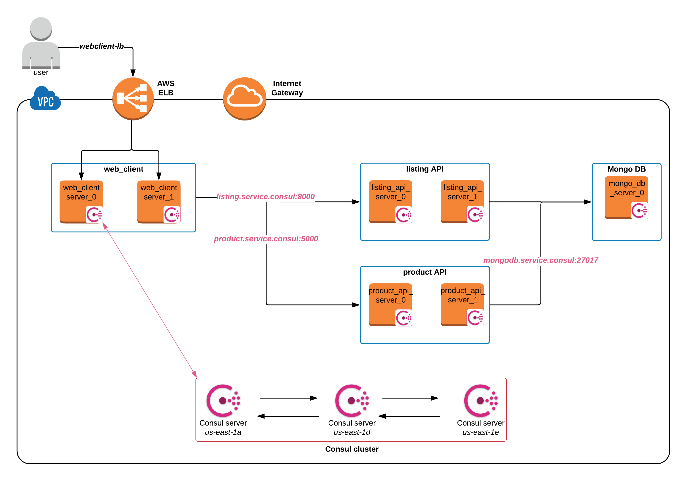

# Service Configuration using Vault's dynamic credentials

This repo demonstrates how to leverage Vault APIs and tools such as [EnvConsul](https://github.com/hashicorp/envconsul/blob/master/README.md) and [Consul-template](https://github.com/hashicorp/consul-template/blob/master/README.md) to allow frictionless integration with applications.

This is an incredibly modified version of [thomashashi/thomas_cc_demo](https://github.com/thomashashi/thomas_cc_demo). If you are looking for a Consul Connect demo, please refer to [thomashashi/thomas_cc_demo](https://github.com/thomashashi/thomas_cc_demo)

**Use-cases demonstrated**:
- Consul: Service Configuration, Service Discovery
- Vault: Dynamic Credentials, AWS EC2 Authentication Method
- Terraform: Infrastructure-as-code

**Time to complete**: 20 - 60 minutes (depending on # of use-cases attempted)

**Persona**: Operations, Development, Security

**[Skip ahead to Running the demo](terraform/aws/README.md)**

## Architecture overview:
This repo uses Terraform to deploy the items below.
1. **Infrastructure components**:
  1. First, a Consul cluster (v1.4.0) is deployed.  Then, a set of client nodes are deployed.  
    - All client nodes have Consul agent running.
    - Consul version is specified in [consul_base.json](packer/consul_base.json) as the `consul_version` variable.

  - A Vault server (v1.0.1) is deployed which will provide dynamic credentials for Mongo DB.
    - Vault will use Consul as its storage backend.
    - Vault version is specified in [install_vault.sh](packer/files/install_vault.sh).

  - A Mongo DB server (v3.6) is deployed that will contain a Database called `bbthe90s`, and 2 Collections: `Products` and `Listing`.
    - Each Collection will be pre-populated with some example records.
    - MongoDB version is specified in [install_mongodb.sh](packer/files/install_mongodb.sh).

  - An AWS Elastic Load Balancer will be deployed that will allow an end user to access the application.

- **Application components**:
  1. A Python [Web Client](application/simple-client) that interacts with the end user, it queries Product and Listing API, then displays the contents on a web page.

  - A Python [Product API](application/product-service/README.md)
    - Application configuration is read from `config.yml` and stored in Consul.
    - [Consul Template](https://github.com/hashicorp/consul-template/blob/master/README.md) (v0.19.5) is used to render the application configuration file and manage application lifecycle.
    - Consult-template version is specified in [install_client_tools.sh](packer/files/install_client_tools.sh).
    - Mongo DB credentials are obtained from Vault using [hvac Vault Python SDK](https://github.com/hvac/hvac). AWS EC2 Authentication is utilized to obtain a Vault token, then read from AWS dynamic secrets engine.

  - A Node.js [Listing API](application/listing-service/blob/master/README.md)
    - Application configuration key value pairs are stored in Consul, and read as Environment Variables.
    - [Envconsul](https://github.com/hashicorp/envconsul) (v0.7.3) is used to render environment variables and manage application lifecycle.
    - EnvConsul version is specified in [install_client_tools.sh](packer/files/install_client_tools.sh).
    - Mongo DB credentials are obtained from Vault by Envconsul. AWS EC2 Authentication is utilized to obtain a Vault token, then provided to EnvConsul to read from AWS dynamic secrets engine.

## Provisioning and Running the demo:
Currently this demo is implemented in AWS platform only. Please follow steps in [Running the Demo](terraform/aws/README.md)

## Architecture Diagram:
*TODO: Add Vault to diagram*

