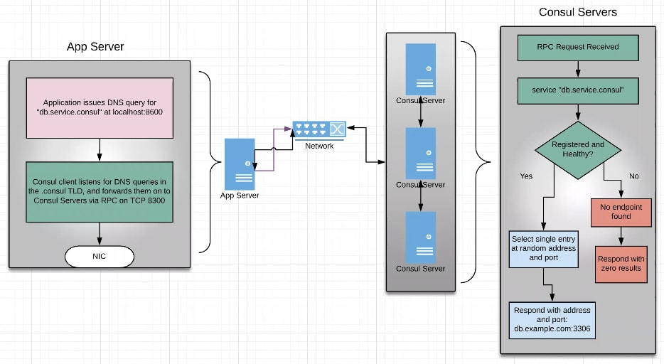
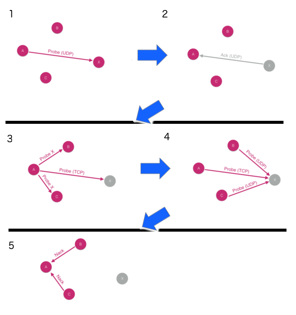
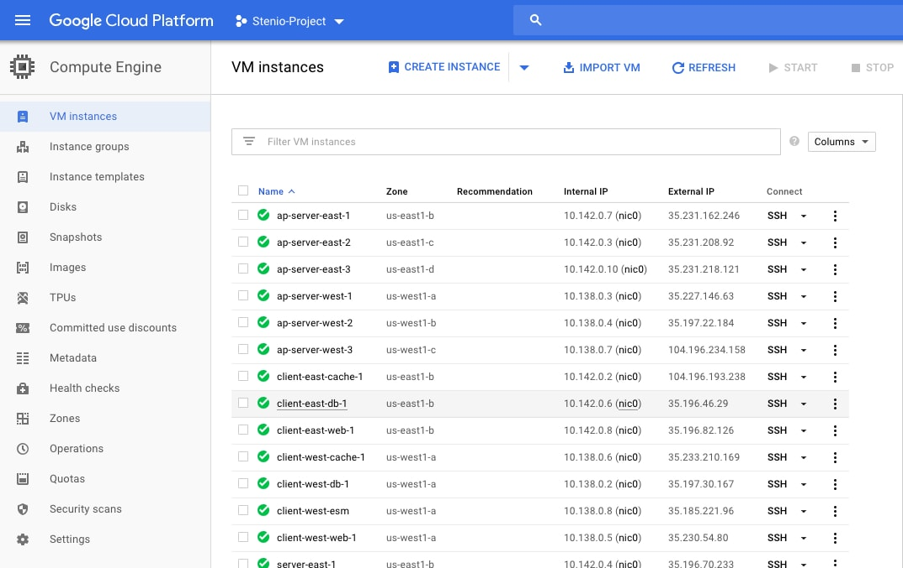
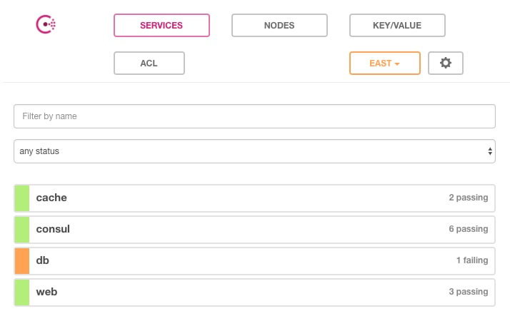

# Consul Prepared Queries
Consul's most common use case is as a service discovery tool. However what happens if an instance in a service fails in one datacenter, however is available in another? Prepared queries can help you with that.

In this guide we will show how to configure Consul using prepared queries, which allows service discovery to happen across datacenters, in a way that is transparent to the caller - an app can continue calling name.service.consul, and it will be automatically redirected to a healthy instance in a different datacenter should the local versions be unhealthy.

As a note, this guide uses Puppet and Packer to create images for the services available in the Consul cluster. These can be used as reference for the workflow, but discussion of Puppet and Packer is outside the scope of this guide, therefore the functionalities are automated using bash script.

## Reference Material
Before going into the guide, it is beneficial to understand a few concepts related to Consul:

### Consul Service Discovery Workflow
A Consul agent that wants to get the ip address, port or dns entry of another service will issue a request to its local Consul agent, for example:
```
 dig @127.0.0.1 -p 8600 db.query.consul
```
By default, the Consul agent will capture requests made to domains ending with "*.consul". 
The agent will send this query to the Consul Servers, which will look for a healthy instance based on the domain informed (in this case "query" and "db"). Additional information on how to use Consul DNS and available options can be found here: https://www.consul.io/docs/agent/dns.html

This diagram represents the communication:


### Consul Health Check Workflow
Consul agents are responsible for tracking the health of a service, locally. If there is a state change (for example the service becomes unavailable), the agent notifies the server of the new state.

To ensure the agent themselves are running, Consul has liveliness checks, which follows the steps:

1. An agent tries to reach another using an UDP call
2. Should this call fail, the agent asks other. agents to issue an UDP call, and it sends a TCP call.
3. If these calls fails because the target agent is down, the original agent gets notified and sends a notification to the cluster of the new unhealthy state.


#### Failure Detection
In order to avoid false positives, Consul has anti-entropy checks that places potentially unhealthy nodes in a "suspect" category, requiring validation from multiple nodes prior to assigning a unhealthy state.

### Cluster Communication
Consul uses Serf protocol for service discovery and orchestration, and raft to achieve consensus in a cluster.

#### Serf
Consul has its roots on the SWIM (Scaleable Weakly-consistent Infection-type process-group Membership) Protocol, which was published in an academic paper describing a protocol for distributed communications. The Serf library was created as an implementation of this protocol, and Consul is built on top of Serf. 

In a nutshell, the protocol implementation provides small, constant network load that scales well, allowing fast propagation and convergence. A presentation of Consul running in massive scale can be found here https://youtu.be/CDQaqiRhTtk.
#### raft
raft is a Go library that manages a replicated log and can be used with an FSM to manage replicated state machines. It is a library for providing consensus.

More info on www.thesecretlivesofdata.com/raft
### Consul Prepared Queries
Within a datacenter, Consul provides automatic failover for services by omitting failed service instances from DNS lookups, and by providing service health information in APIs. When there are no more instances of a service available in the local datacenter, it can be challenging to implement failover policies to other datacenters because typically that logic would need to be written into each application.

Fortunately, Consul has a prepared query capability that lets users define failover policies in a centralized way. It's easy to expose these to applications using Consul's DNS interface and it's also available to applications that consume Consul's APIs. These policies range from fully static lists of alternate datacenters to fully dynamic policies that make use of Consul's network coordinate subsystem to automatically determine the next best datacenter to fail over to based on network round trip time. Prepared queries can be made with policies specific to certain services and prepared query templates allow one policy to apply to many, or even all services, with just a small number of templates. Consul will find the instance that is closest to the requester.

### Consul Configuration Files
The health checks done locally by the consul agents are defined through configuration files. These can be found in services, and are used by Packer when creating the machine images.

### Consul Use Cases
This guide will focus on Consul for Service Discovery and Prepared Queries. Additional uses for Consul include Runtime Configuration and Orchestration, and Advanced Networking. <links to other guides here> 

## Estimated Time to Complete
60 minutes

## Challenge
Assuming different instances of identical services deployed in multiple datacenters, how to use Consul to allow transparent failover across datacenters. 

## Solution
Prepared Queries allows a Consul admin to define in advance which services will be available across datacenters in the event of a failure.

## Prerequisites
- A GCP account with "Compute Engine API" enabled
- Consul binaries (you can use your own or download the latest open source version here)

## Steps
### Step 1: Configure Environment
- Ensure you have a GCP project, or create one, instructions here
https://cloud.google.com/resource-manager/docs/creating-managing-projects
- Create and Download GCP service account json, instructions here https://cloud.google.com/iam/docs/creating-managing-service-account-keys
- Set the environment variable with credentials and project id:
```
export GOOGLE_APPLICATION_CREDENTIALS=PATH_TO_GCP_CREDENTIALS.json
export GOOGLE_PROJECT=PROJECT_ID
```
- Update the variables in _interface.tf. If you do not have an ssh key, you can create the public and the private by executing:
```
ssh-keygen -t rsa -C 
```
Where public key will end in .pub

### Step 2: Create Images
Once you have cloned this repository locally, execute:
```
cd packer
./build.sh PATH_TO_GCP_JSON_FILE PROJECT_NAME GCP_REGION
```
### Step 2: Deploy Consul Clusters
In this step, we will use Terraform to create two Consul clusters in GCP in two different datacenters. Each cluster will have cache, db and web, in addition to consul services. 

Commands:
```
cd ..
terraform init
terraform plan
terraform apply
```

#### Output
```
Apply complete! Resources: 10 added, 9 changed, 10 destroyed.

Outputs:

server_ips = [
    IP1,
    IP2,
    IP3
]
```
### Step 3: Validate Consul Cluster
- Go to the consul UI in http://IP1:8500 
- Validate all services healthy
- Open GCP Console and go to the Compute Engine screen:

- Click on "SSH" button of "client-east-web-1" to connect to the web instance using the browser
- Execute:
```
# To get the ip address of the db service in this datacenter
 dig @127.0.0.1 -p 8600 db.query.consul
# Output:
; <<>> DiG 9.10.3-P4-Ubuntu <<>> @127.0.0.1 -p 8600 db.query.consul
; (1 server found)
;; global options: +cmd
;; Got answer:
;; ->>HEADER<<- opcode: QUERY, status: NOERROR, id: 24942
;; flags: qr aa rd; QUERY: 1, ANSWER: 1, AUTHORITY: 0, ADDITIONAL: 1
;; WARNING: recursion requested but not available
;; OPT PSEUDOSECTION:
; EDNS: version: 0, flags:; udp: 4096
;; QUESTION SECTION:
;db.service.consul.             IN      A
;; ANSWER SECTION:
db.service.consul.      0       IN      A       10.142.0.6
;; Query time: 10 msec
;; SERVER: 127.0.0.1#8600(127.0.0.1)
;; WHEN: Wed May 23 17:38:03 UTC 2018
;; MSG SIZE  rcvd: 62

```

### Step 4: Simulate service failure
- On the GCP Console, click on "SSH" button of "client-east-db-1" to connect to the db instance using the browser
- Execute:
```
sudo service mongodb stop
```
- Now if you check the Consul UI, you will see the following:

- And if you SSH back into the web instance and execute again:
```
 dig @127.0.0.1 -p 8600 db.query.consul
 ```
 You will get:
 ```
 # Output:
 ; <<>> DiG 9.10.3-P4-Ubuntu <<>> @127.0.0.1 -p 8600 db.query.consul
; (1 server found)
;; global options: +cmd
;; Got answer:
;; ->>HEADER<<- opcode: QUERY, status: NXDOMAIN, id: 38014
;; flags: qr aa rd; QUERY: 1, ANSWER: 0, AUTHORITY: 1, ADDITIONAL: 1
;; WARNING: recursion requested but not available
;; OPT PSEUDOSECTION:
; EDNS: version: 0, flags:; udp: 4096
;; QUESTION SECTION:
;db.service.consul.             IN      A
;; AUTHORITY SECTION:
consul.                 0       IN      SOA     ns.consul. hostmaster.consul. 1527097579 3600 600 86400 0
;; Query time: 2 msec
;; SERVER: 127.0.0.1#8600(127.0.0.1)
;; WHEN: Wed May 23 17:46:19 UTC 2018
;; MSG SIZE  rcvd: 96
 ```
 Which means no healthy db service found.

### Step 5: Configure Prepared Queries
Despite the above, we know that the db service is still healthy in the "West" datacenter. Let's configure Consul with Prepared Queries to allow requests from the "East" for "db" to failover to "West" when needed.

Run:
```
cd consul
terraform init
```

For the purposes of this demo, since we wanted the prepared queries to be in a second step, update the variables SERVER_EAST_1_PUBLIC_IP and SERVER_WEST_1_PUBLIC_IP in consult/consul.tf with the public IPs of Consul servers server-east-1 and server-west-1 found in the GCP Console. The configuration update will be propagated to the other Consul servers accordingly.

Once that is done, run:
```
terraform plan
terraform apply
cd ..
```

### Step 6: Validate Prepared Queries
Now go back to the web instance, and execute:
```
dig @127.0.0.1 -p 8600 db.query.consul

# Output
 <<>> DiG 9.10.3-P4-Ubuntu <<>> @127.0.0.1 -p 8600 db.query.consul
; (1 server found)
;; global options: +cmd
;; Got answer:
;; ->>HEADER<<- opcode: QUERY, status: NOERROR, id: 50758
;; flags: qr aa rd; QUERY: 1, ANSWER: 1, AUTHORITY: 0, ADDITIONAL: 1
;; WARNING: recursion requested but not available
;; OPT PSEUDOSECTION:
; EDNS: version: 0, flags:; udp: 4096
;; QUESTION SECTION:
;db.query.consul.               IN      A
;; ANSWER SECTION:
db.query.consul.        30      IN      A       10.138.0.2
;; Query time: 70 msec
;; SERVER: 127.0.0.1#8600(127.0.0.1)
;; WHEN: Wed May 23 18:16:12 UTC 2018
;; MSG SIZE  rcvd: 60
```
This proves that the web client was able to reach the healthy DB instance in the West datacenter.

### Step 7: Cleanup
Once you are satisfied with the tests, execute the following to destroy the resources created:
```
pwd
# Ensure you are in the root of this repository, if not get there

terraform destroy
```

